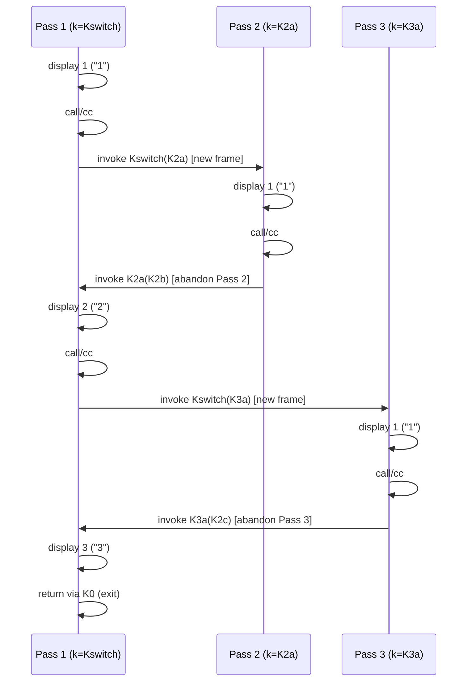

# `call-with-current-continuation`: Environment Semantics

## The example

```scheme
(define (mondo-bizarro)
  (let ((k (call-with-current-continuation (lambda (c) c))))
    (display 1)
    (call-with-current-continuation (lambda (c) (k c)))
    (display 2)
    (call-with-current-continuation (lambda (c) (k c)))
    (display 3)))

(mondo-bizarro)   ;=> prints 11213
```

At first glance this looks like it should print `123` once. It instead
prints `11213` and then *terminates* — `mondo-bizarro` never even reaches
its own end normally the way you'd expect. Understanding why requires
understanding exactly what `call/cc` captures and what happens on both
invocation ("calling in") and continuation-*invocation* ("returning
into") a saved continuation.

## The core model

`call-with-current-continuation` (short: `call/cc`) takes a single
procedure `f` of one argument. It reifies "the rest of the computation
at the point of the call" — including the **lexical environment** in
scope at that point — as a first-class procedure `c`, and calls
`(f c)`.

Two facts drive everything else in this document:

1. **A continuation is a full environment/control snapshot, not just a
   jump address.** Every variable binding visible at the point of
   capture (here, the binding of `k` and the enclosing `let`/lambda
   frames) is frozen into the continuation. When the continuation is
   later invoked, execution resumes *with that frozen environment*,
   not with whatever environment was active at the call site that
   invoked it.
2. **Invoking a continuation never returns to its invoker.** `(c v)`
   does not behave like a normal call that eventually gives control
   back to whoever wrote `(c v)`. It performs a non-local transfer: the
   entire "current continuation" of the invoking expression is thrown
   away, and is replaced by the one that was captured. `v` becomes the
   value that the original `call/cc` expression "returns" inside that
   frozen environment. If nobody ever invokes the abandoned
   continuation again, the code that was "in flight" at the invocation
   site is simply lost — as if it never happened.
3. **A captured continuation can be invoked more than once** (it is
   not consumed after first use). Each invocation is an independent
   resumption. If the capture point lexically precedes the creation of
   a new binding (like the `let` here), each resumption creates a
   *fresh* binding for that variable — the different resumptions do
   not share or overwrite each other's bindings.

Everything about `mondo-bizarro`'s odd output follows mechanically from
these three rules.

## Naming the continuations

Three `call/cc` sites exist in the body; each execution of the `let`
body creates *new* continuation objects at sites 2 and 3, so we index
them by "pass":

| Name       | Captured at                       | Frozen environment | Frozen "remaining code" |
|------------|------------------------------------|---------------------|---------------------------|
| `K0`       | (implicit) call to `mondo-bizarro` | caller's env         | return from `mondo-bizarro` |
| `Kswitch`  | `call/cc` #1 (`(lambda (c) c)`)    | *none yet* — this is the continuation of the `let`'s init expression | bind result to `k` (new frame each time), run body `B`, then `K0` |
| `K2a`      | `call/cc` #2, **pass 1** (`k` = `Kswitch`) | `k = Kswitch` | `(display 2) call/cc#3 (display 3)`, then `K0` |
| `K2b`      | `call/cc` #2, **pass 2** (`k` = `K2a`)     | `k = K2a` | `(display 2) call/cc#3 (display 3)`, then `K0` (never used) |
| `K3a`      | `call/cc` #3, **pass 1** (`k` = `Kswitch`) | `k = Kswitch` | `(display 3)`, then `K0` |
| `K2c`      | `call/cc` #2, **pass 3** (`k` = `K3a`)     | `k = K3a` | `(display 2) call/cc#3 (display 3)`, then `K0` (never used) |

`B` denotes the `let` body:
`(display 1) call/cc#2 (display 2) call/cc#3 (display 3)`.

## Step-by-step trace

**Pass 1 — enter the `let`.**
`call/cc` #1 captures `Kswitch` and immediately calls its receiver
`(lambda (c) c)` with `c = Kswitch`, which simply returns `Kswitch` as
the value of the `call/cc` expression. So on the very first pass,
`k` is bound to `Kswitch` itself (a continuation, not a normal value!).

```
k = Kswitch
(display 1)                 → prints "1"
call/cc #2 captures K2a  (env frozen: k = Kswitch)
  (lambda (c) (k c)) called with c = K2a
  → invoke Kswitch with K2a
```

Invoking `Kswitch` does **not** return here. It re-enters the `let`
binding point, creates a **new, independent frame**, and binds its `k`
to the argument, `K2a`. This starts "pass 2" — pass 1 is suspended
in mid-flight, parked at `K2a`, waiting to be resumed later.

**Pass 2 — resumed with `k = K2a`.**

```
k = K2a
(display 1)                 → prints "1"    (cumulative: "11")
call/cc #2 captures K2b  (env frozen: k = K2a)
  (lambda (c) (k c)) called with c = K2b
  → invoke K2a with K2b
```

Invoking `K2a` transfers control back into **pass 1's** frozen
environment (`k = Kswitch`), at the point right after its `call/cc`
#2 — making that expression evaluate to `K2b` (the value is unused,
just discarded as an expression statement). Pass 2's own remaining code
(`(display 2) call/cc#3 (display 3)` under `k = K2a`) is *abandoned* —
it will never run.

**Back in pass 1, resuming after `call/cc` #2.**

```
k = Kswitch   (pass 1's own binding, untouched by pass 2)
(display 2)                 → prints "2"    (cumulative: "112")
call/cc #3 captures K3a  (env frozen: k = Kswitch)
  (lambda (c) (k c)) called with c = K3a
  → invoke Kswitch with K3a
```

`Kswitch` is invoked again — a **second, brand-new** frame is created
("pass 3"), with `k = K3a`. Pass 1 is again suspended, this time
parked at `K3a`.

**Pass 3 — resumed with `k = K3a`.**

```
k = K3a
(display 1)                 → prints "1"    (cumulative: "1121")
call/cc #2 captures K2c  (env frozen: k = K3a)
  (lambda (c) (k c)) called with c = K2c
  → invoke K3a with K2c
```

Invoking `K3a` transfers control back into **pass 1's** environment
again, this time at the point right after `call/cc` #3, making that
expression evaluate to `K2c` (again discarded). Pass 3's remaining code
is abandoned, exactly like pass 2's was.

**Back in pass 1, resuming after `call/cc` #3 — for good this time.**

```
k = Kswitch
(display 3)                 → prints "3"    (cumulative: "11213")
```

`B` now runs to completion. Its value flows out through the `let` to
`K0` — an ordinary return from `mondo-bizarro`. Nothing invokes
`Kswitch`, `K2a`, `K2b`, `K2c` or `K3a` again, so the program simply
ends.

Total output, in order: `1` `1` `2` `1` `3` → **`11213`**.

## Control-flow diagram



## Key takeaways about environment handling

- **Capture = closure over environment + control.** `call/cc` doesn't
  just remember "where to jump back to" — it remembers *which
  bindings* (`k`, and any enclosing lexical frames) were in scope, as
  they existed at that instant. Two different captures at the *same*
  source location (`call/cc` #2 in pass 1 vs. pass 2 vs. pass 3) are
  different continuation objects with different frozen `k` bindings,
  because each pass created its own fresh frame for `k`.
- **Invocation replaces the environment, it doesn't merge with it.**
  When `K2a` is invoked from inside pass 2, pass 2's environment
  (`k = K2a`) is discarded outright and replaced by pass 1's frozen
  environment (`k = Kswitch`). There is no notion of "returning a
  value back to the caller's frame" the way a normal function return
  works — the caller's frame *is* what gets thrown away.
- **A `call/cc` capture point that precedes a binding form is
  re-entrant.** Because `Kswitch` was captured *before* `k` had a
  value, every invocation of `Kswitch` re-enters the `let` and
  allocates a **new** location for `k`. This is what allows
  `mondo-bizarro` to "restart itself" twice (passes 2 and 3) without
  passes 2/3 interfering with each other or with pass 1's `k`.
- **Continuations are multi-shot and independent.** `Kswitch` is
  invoked twice (with `K2a`, then with `K3a`); nothing about invoking
  it once consumes or invalidates it. Likewise, capturing `K2a`,
  `K2b`, `K3a`, `K2c` doesn't interfere with each other — most of them
  (`K2b`, `K2c`) simply end up never being invoked, and the code they
  would have resumed is silently abandoned.
- **"Abandoned" computation is not an error, just unreachable code.**
  Pass 2's and pass 3's tails (`(display 2) call/cc#3 (display 3)`
  under `k = K2a` / `k = K3a` respectively) are syntactically part of
  the program but are never executed, because control is diverted
  away via `(k c)` before reaching them. This is why the naive
  reading "it should print `123` three times" is wrong: only pass 1
  ever runs to completion.

## Relation to this repository

The `mondo` package (`src/main/java/mondo/`) is a small experimental
Java model of Scheme-style continuations (`Continuation`, `Mondo`,
`Counted`) built to explore exactly this kind of re-entrant,
multi-shot control flow as groundwork for `call/cc` support in the
Scream interpreter. `Mondo.Let` currently models a simpler, strictly
sequential CPS chain (`1→2→3→4`); it does not yet implement the
"jump backwards into an earlier frame" behavior described above
(invoking an *older* captured continuation to re-enter an *earlier*
environment), which is the crux of the `mondo-bizarro` example.
